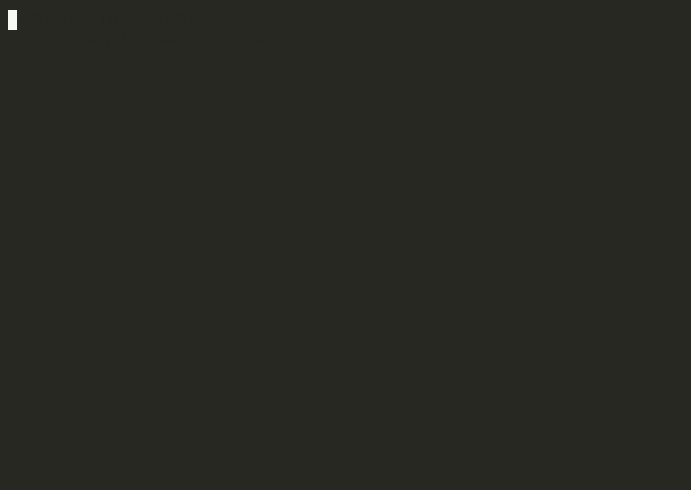

# agentwit

**Debug and audit AI agent ↔ MCP server tool calls.**

```bash
pip install agentwit
agentwit proxy --target http://localhost:3000 --port 8765
```

```
[agentwit] 14:32:01  tools/call  bash       HIGH ⚠  shell_exec
[agentwit] 14:32:03  tools/call  read_file  LOW  ✓
[agentwit] 14:32:05  tools/call  bash       CRITICAL 🚨 privilege_escalation  LLM06
```

Change one URL. No MCP server modification needed.



[日本語版](README.ja.md) · [PyPI](https://pypi.org/project/agentwit/) · [Releases](https://github.com/tokotokokame/agentwit/releases)

[](https://www.python.org/)
[](https://pypi.org/project/agentwit/)
[](#)
[](LICENSE)
[](docs/api-reference.md#owaspmapper)
[](docs/plugin-guide.md)

---

## The problem

When an AI agent calls MCP server tools, **you can't see what's happening.**

```
AI Agent
↓  (black box)
MCP Server  →  bash / read_file / fetch / ...
```

agentwit sits between them as a transparent proxy and records everything.

```
AI Agent
↓
agentwit  ←  logs every call · detects risks · verifies integrity
↓
MCP Server  (zero modification)
```

---

## 5-minute quickstart

```bash
pip install agentwit

# 1. Start the proxy
agentwit proxy --target http://localhost:3000 --port 8765

# 2. Point your agent to port 8765 instead of 3000
#    That's it. Recording starts immediately.

# 3. Generate an audit report
agentwit report --session ./witness_logs/SESSION_ID --format html

# 4. Verify log integrity
agentwit verify --session ./witness_logs/SESSION_ID
# Chain integrity:  VALID ✓
# Signature check:  VALID ✓
```

→ Full guide: [docs/quickstart.md](docs/quickstart.md)

---

## Features

### Log recording
- Tamper-proof SHA-256 chain — detect any modification
- ed25519 signatures — prove who recorded the log
- HTML / Markdown / JSON report generation
- Auto-backup to `~/.agentwit/backups/` on session end

### Risk detection
- 15+ built-in patterns: `shell_exec`, `privilege_escalation`, `data_exfiltration`, `jailbreak`, ...
- Prompt injection detection (CRITICAL/HIGH/MEDIUM/LOW)
- Tool schema change detection
- Agent thought & reasoning recording (LangChain)

### OWASP LLM Top 10 mapping *(v1.0.0)*

Every detected risk is automatically tagged with the corresponding OWASP LLM category:

| OWASP LLM | Category | Detected patterns |
|---|---|---|
| LLM01 | Prompt Injection | `instruction_override` / `role_hijack` / `jailbreak` |
| LLM02 | Sensitive Info Disclosure | `credential_access` / `data_exfiltration` |
| LLM06 | Excessive Agency | `privilege_escalation` / `persistence` / `lateral_movement` |
| LLM08 | Integrity Failures | `tool_schema_change` / `proxy_bypass_detected` |
| LLM10 | Unbounded Consumption | `call_rate_anomaly` / `session_cost_exceeded` |

```python
from agentwit.analyzer.owasp_mapper import OWASPMapper
mapper = OWASPMapper()
mapper.map("privilege_escalation")  # → "LLM06"
mapper.map_events(events)           # → adds owasp_category to each event
```

### Plugin API *(v1.0.0)*

Add custom detection rules as external packages — no fork needed:

```python
# my_package/plugin.py
from agentwit.plugins.base import PluginBase

class MyPlugin(PluginBase):
    def scan(self, event: dict) -> list[dict]:
        if "dangerous_pattern" in str(event):
            return [{"pattern": "my_pattern", "severity": "HIGH",
                     "description": "Custom detection"}]
        return []
```

```toml
# pyproject.toml of your plugin package
[project.entry-points."agentwit.plugins"]
my_plugin = "my_package:MyPlugin"
```

```bash
pip install agentwit-plugin-myname
agentwit proxy --target http://localhost:3000 --port 8765
# → plugin auto-loaded on startup
```

→ Full guide: [docs/plugin-guide.md](docs/plugin-guide.md)

### SIEM integration *(v1.0.0)*

Forward audit logs to Splunk, Elasticsearch, or Grafana Loki via Fluent Bit:

```bash
# docker/docker-compose.siem.yml
SPLUNK_HEC_TOKEN=your-token docker compose -f docker/docker-compose.siem.yml up
```

Supports: Splunk HEC · Elasticsearch · Grafana Loki

### MCP Inspector GUI

Desktop app for real-time MCP server debugging.

**Download:** [GitHub Releases](https://github.com/tokotokokame/agentwit/releases)
- Linux: `.deb` / `.rpm` / `.AppImage`
- Windows: `.msi` (via GitHub Actions)

#### GUI features
- 3-pane layout: Server info + Tool list / Parameter editor + Response / History + Metrics + Compare
- **Export Report button** — generate HTML audit report from History tab with one click
- EN/JP language support
- Real-time risk score display

```
┌─────────────────┬──────────────────────┬─────────────────────┐
│  Server Info    │  Parameter Editor    │  History            │
│  ─────────────  │  ──────────────────  │  ─────────────────  │
│  Tools          │  {                   │  [Export Report]    │
│  ✓ bash   EXEC  │    "command": "ls"   │                     │
│  ✓ read   READ  │  }                   │  14:32 bash  HIGH   │
│  ✓ fetch  READ  │                      │  14:33 read  LOW    │
│                 │  [Execute]           │  14:34 bash  CRIT   │
└─────────────────┴──────────────────────┴─────────────────────┘
```

---

## Transports

| Transport | Status | How to use |
|---|---|---|
| Streamable HTTP | ✅ | `agentwit proxy --target http://localhost:3000` |
| SSE (legacy) | ✅ | auto-detected |
| stdio | ✅ | `agentwit proxy --stdio -- python mcp_server.py` |

---

## LangChain integration

```bash
pip install agentwit[full]
```

```python
from agentwit import AgentwitCallback

callbacks = [AgentwitCallback(output="./audit.jsonl")]

# Agent thoughts and reasoning are also recorded:
# {"type": "agent_thought", "thought": "...", "tool_selected": "bash",
#  "reasoning": "...", "timestamp": "..."}
```

---

## CLI reference

```bash
# Proxy
agentwit proxy --target http://localhost:3000 --port 8765
agentwit proxy --target http://localhost:3000 --port 8765 --timeout 60
agentwit proxy --stdio -- python mcp_server.py
agentwit proxy --target http://localhost:3000 \
  --webhook https://hooks.slack.com/xxx \
  --webhook-on HIGH,CRITICAL

# Reports
agentwit report --session ./witness_logs/SESSION_ID --format json
agentwit report --session ./witness_logs/SESSION_ID --format markdown
agentwit report --session ./witness_logs/SESSION_ID --format html --output ./report.html

# Verification
agentwit verify --session ./witness_logs/SESSION_ID
agentwit replay --session ./witness_logs/SESSION_ID
agentwit diff --session-a ./witness_logs/A --session-b ./witness_logs/B
```

→ Full reference: [docs/api-reference.md](docs/api-reference.md)

---

## Guard vs. Witness

| Tool | Approach | Blocks calls | Tamper-proof log |
|---|---|---|---|
| mcp-scan | Proxy + Guard | ✅ | ❌ |
| Intercept | Policy proxy | ✅ | ❌ |
| **agentwit** | **Witness proxy** | **❌** | **✅** |

agentwit does not block. It **witnesses**.  
A blocked call leaves no trace. A witnessed call leaves evidence.

---

## Version history

| Version | Date | Highlights |
|---|---|---|
| v0.1.0 | 2026-03-14 | MVP: HTTP/SSE/stdio proxy, SHA-256 chain log |
| v0.2.0 | 2026-03-15 | HTML report, LangChain, Slack/Discord webhook |
| v0.3.0 | 2026-03-16 | MCP Inspector GUI, standard `/mcp` endpoint |
| v0.4.0 | 2026-03-21 | MCP spec auto-follow, injection detection, tool monitoring |
| v0.5.0 | 2026-03-22 | ed25519 signatures, bypass detection, anomaly detection |
| v0.6.0 | 2026-03-22 | GUI Export Report, agent thought recording, error handling |
| v0.7.0 | 2026-03-22 | OWASP LLM Top 10 mapping, Windows build (GitHub Actions) |
| **v1.0.0** | **2026-03-22** | **Plugin API, SIEM integration, full docs, GUI tests** |

---

## Documentation

| Doc | Contents |
|---|---|
| [docs/quickstart.md](docs/quickstart.md) | 5-minute getting started guide |
| [docs/architecture.md](docs/architecture.md) | Architecture and design philosophy |
| [docs/api-reference.md](docs/api-reference.md) | Full CLI and Python API reference |
| [docs/plugin-guide.md](docs/plugin-guide.md) | Plugin development guide |
| [CONTRIBUTING.md](CONTRIBUTING.md) | How to contribute |
| [CHANGELOG.md](CHANGELOG.md) | Full version history |

---

## License

MIT — see [LICENSE](LICENSE)
